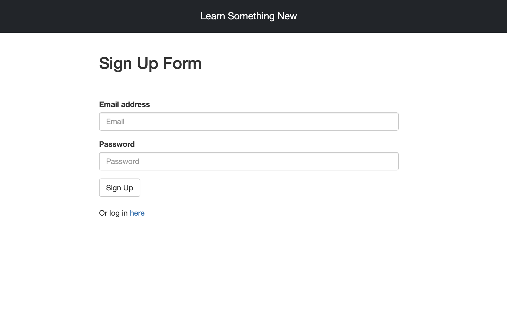
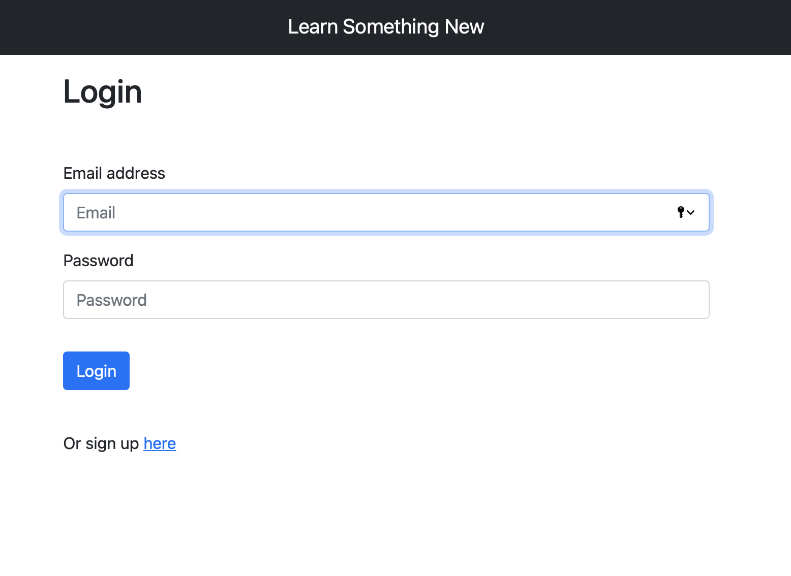
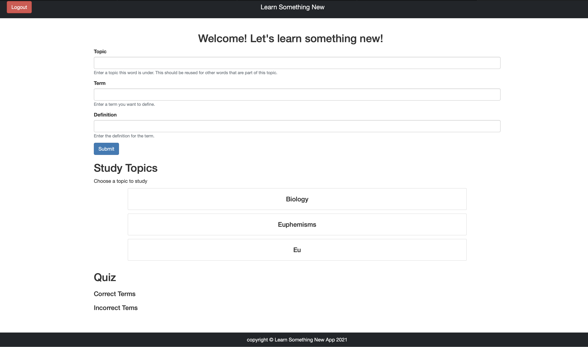
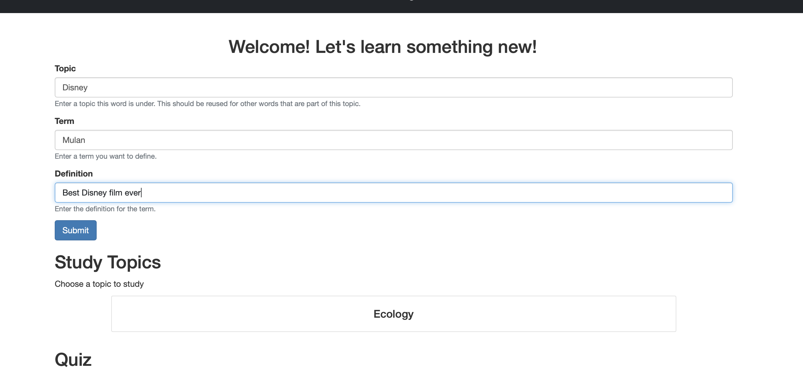
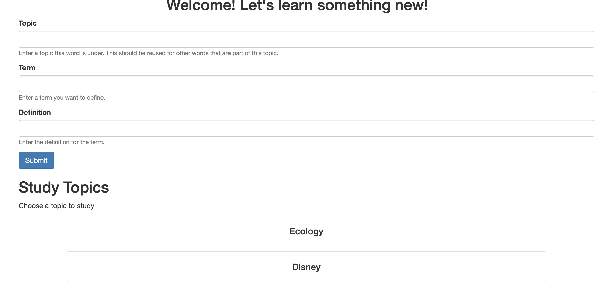
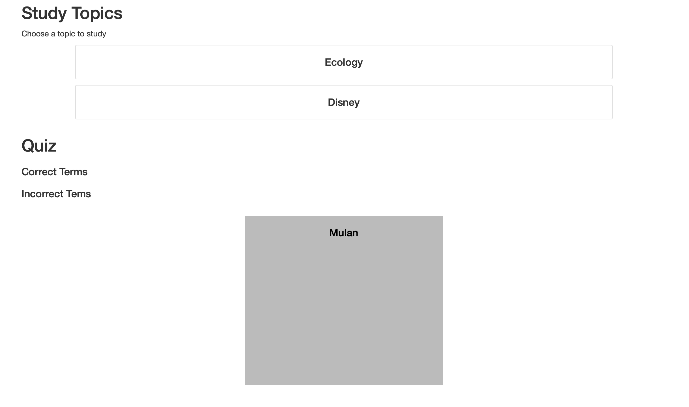
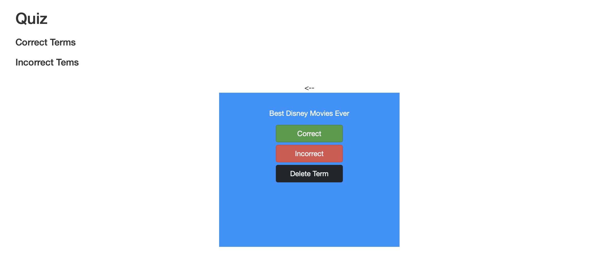

# Learn Something New

# Description 
"Learn Something New" is a web app that allows users to make their flashcards.  Makeing flashcards is a helpful way for people to learn new vocabulary quickly.  You simply speccify the topic, term, and definition in the correct fields provided in the app, and click submit, and this will create a flash card.  This app is an authenticated app the requires users to login.  This makes sure users only see the cards they create.  

# Use

## [Learn Something New](https://dashboard.heroku.com/apps/young-atoll-67512)

To use the app, you must first sign up.  It just requires your email and for you to set a password that is greater than 8 characters in length.  

Once made, you can login, it will look like this: 

In either case, you will be redirected to the welcome page for your account. 

On this page, you can make flash cards by putting a topic, term, and definition and clicking submit. 

Once submitted, you will see a rectangular card below witht the name of the topic you chose.

If you click on this topic, cards in the quiz section below will appear.  Any card with the same topic will appear below, so if there are ten terms with the same topic, 10 cards will apear. 

Hovering over the card will trigger it to flip over.  The idea here is that you make a guess of the definiton, and then hover over and see the defintion. 

If you were correct, click correct, and the term will show up under the Correct section, or click incorrect and it will show up in the incorrect sections. 

You can also delete terms and they will disappear. Whether you click correct, incorrect, or delete, the flash card will be removed from the DOM.  You can click other topics and cards will be appended to the bottom of the page. 

# Technologies used
This project used the following technologies

- node.js
- express.js
- passport.js
- javascript
- HTML
- CSS (bootstrap)
- Sequelize
- MySQL 
- Handlebars 
- eslint

# Contributions

This project was a collaboration between the following individuals

- Matthew Heering
- Chris Stanfill
- Sarah Peitz 
- Louis Werner
- Chris Bone 

#  Future Direction
This project was a great learning experience in full stack web development.  Each issue we encountered was a learnign opportunity to gain more insight into this exciting field.  The app is far from perfect, however, it is fucntional in its current iteration.  With that said there are some future features we want to add to make this a more enticing app for users to use to expand their vocabulary and learn new ideas, below are some ideas we have for the future of this app: 

- Dark Mode:  Users can click a button and the application takes on a darker theme in appearance and use.  Users can search terms on urban dictionary and add them to topics they create. 
- Light Mode:  Users can click a button and the aplication takes on a lighter theme in appearance and use.  Users can search terms on Webster's dictionary and add them to topics they create. 
- Game modes to test knowledge that keep score. This would add drag and drop features for users.  
- Tect to speech:  Users click a button and hear how a word is pronounced using the google API.  Was unable to implement this becuase of cost.  
- Provide a share feature to share decks to other users. 
- Integrate with the Canvas, a learning management system used by educators around the world to create assignments for students to study vocabulary. 

We wanted to try and complete the first two in the time alloted, however, we were unable to find time to execute and commit these options to the application.  

#  Special Thanks
We would like to thank Brandon Max and Paal Williams for their help and insight into building this application.  Their guidance was helpful and informative.  Their guidance helped us deliver an application we are proud to have built.  
